# Assignment 4 — Edge & Scale: Step-by-Step Testing Guide

This guide walks through **every deliverable** of Assignment 4 for the
BookReviews app **as actually verified on this machine**. For each deployable
you get: (1) what it proves, (2) the exact commands, and (3) **what to look
for** in the output/browser so you know the requirement is met.

Assignment: `assignments/assignment4.md` (assigned reverse proxy: **Nginx —
Group 1**).

---

## 0. Requirements map (what you are proving, and where)

| # | Assignment requirement | Guide section |
|---|------------------------|---------------|
| 1 | Reverse proxy serves the app under `app.localhost` | 3 |
| 1 | TLS terminated at the proxy (HTTPS, self-signed OK) | 3 |
| 1 | Upload book cover **and** author images | 2 / 3 (UI upload checklist) |
| 1 | Upload storage path configurable | 2.1 (env table) |
| 1 | No proxy → app serves static; proxy → proxy serves **and caches** static | 2 vs 3 |
| 2 | Proxy acts as load balancer across **≥ 3 instances** | 5 |
| 2 | Application stateless (sessions + uploads in shared storage) | 5 |
| 2 | Stopping one instance does not break the app | 5.2 (failover) |
| D1 | Compose: 4 deployments (single / +proxy / +cache+search / x3+LB) | 2–5 |
| D2 | Kubernetes: 3 replicas + edge + Service, any replica serves | 6 |
| D3 | Load test, single-instance **and** x3, 1/10/100/1000/5000 req | 7 |
| D3 | Per-container CPU % / memory / threads + response times / codes | 7.3 |
| D3 | 4 endpoints, one per tier, **reported separately** | 7.1 |
| D4 | Report (≤15 pages) with the listed sections | 9 |

---

## 1. Prerequisites

- Docker with Compose v2 (`docker compose`; `docker buildx` NOT required).
- `mise` with Elixir 1.17.3 / OTP 26 (pinned in `mise.toml`). System `mix`
  (1.12.2) is too old:
  ```bash
  mise x -- mix test            # always run tests through mise
  ```
- `k3d` + `kubectl` (Kubernetes section only).
- Python 3 (the load test is stdlib-only) + `matplotlib`/`numpy` for plots
  (`python3 -m pip install matplotlib numpy`).

### 1.1 Point `app.localhost` at localhost

```bash
echo "127.0.0.1 app.localhost" | sudo tee -a /etc/hosts
```

All proxy deployments are reachable at `https://app.localhost` with a
self-signed certificate. In a browser accept the warning; in curl add `-k`.

### 1.2 Build the application and edge images

```bash
docker build -t book_reviews/app:4.0.0 .
docker build -t book_reviews/nginx:4.0.0 ./nginx
```

### 1.3 One file, four profiles (only one combination runs at a time)

A single `docker-compose.yml` holds **all four topologies**, selected by a
Compose profile so that **only that combination's services (and memory) run**:

| Profile | Topology                                   | Command                                        |
|---------|--------------------------------------------|------------------------------------------------|
| `base`  | Deployment 1: app + MongoDB                | `docker compose --profile base up -d`          |
| `proxy` | Deployment 2: + Nginx edge (TLS/static)    | `docker compose --profile proxy up -d`         |
| `full`  | Deployment 3: + Redis + OpenSearch         | `docker compose --profile full up -d`          |
| `scale` | Deployment 4: 3 apps + LB + cache + search | `docker compose --profile scale up -d`         |

`mongodb` is the only always-on service and is shared by every profile via the
same named volume, so data (and the seed) persist across switches. Because
exactly one combination is up at a time, the shared host ports below never
collide:

| Port   | Owner                                            |
|--------|--------------------------------------------------|
| 80/443 | Nginx edge (proxy/full/scale)                    |
| 27017  | MongoDB (shared, always on)                      |
| 6379   | Redis cache (full & scale)                       |
| 9200   | OpenSearch (full & scale)                        |
| 4000   | app (base profile only)                          |

Switching deployments is `docker compose --profile <old> down` then
`docker compose --profile <new> up -d`. **Always tear down before switching** —
a left-over `scale` stack will hold ports 443, 6379 and 9200 and break the next
profile's startup.

---

## 2. Deployment 1 — Application + Database (no proxy)

Requirement: *"If a reverse proxy is not present, your application serves the
static assets."*

**What this proves:** the app alone serves HTML, assets, uploads and the
configuration API — the baseline everything else is compared against.

### 2.1 Start and what the environment means

```bash
docker compose --profile base up -d --build
```

The `app` service runs with `SERVE_STATIC_ASSETS=true` and `UPLOADS_PATH` **unset**,
so files live in the instance's own `priv/static/uploads`. Configurable env vars
(relevant for 3 too):

| Env var             | Meaning                                            |
|---------------------|----------------------------------------------------|
| `SERVE_STATIC_ASSETS` | `true` = app serves assets; `false` = edge does  |
| `UPLOADS_PATH`        | shared storage for cover/author images; `nil` = local `priv/static/uploads` |
| `STATIC_DIR`          | shared dir where the compiled `priv/static` is published for the edge |
| `CACHE_ENABLED` / `REDIS_URL`, `SEARCH_ENABLED` / `OPENSEARCH_URL` | A3 cache & search toggles |

### 2.2 Checks — what to look for

| Run                                                        | Expected | Meaning |
|------------------------------------------------------------|----------|---------|
| `curl -s -o /dev/null -w '%{http_code}\n' http://localhost:4000/` | `200` | app is up |
| `curl -s -o /dev/null -w '%{http_code}\n' http://localhost:4000/assets/css/app.css` | `200` | **app** serves static when no proxy |
| `curl -s http://localhost:4000/api/features` | `{"serve_static":true,"uploads_path":".../priv/static/uploads",...}` | flag is on, local upload path |

Upload a file locally and fetch it back (static served by the app):
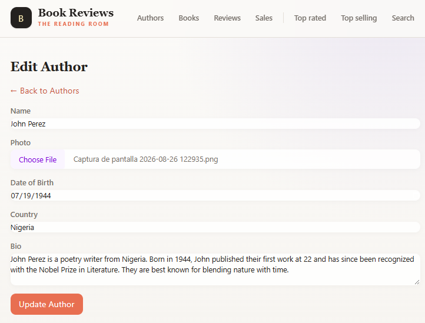
```bash
docker exec book_reviews_app sh -c \
  'mkdir -p /app/lib/book_reviews-0.1.0/priv/static/uploads/covers \
   && echo coverbytes > /app/lib/book_reviews-0.1.0/priv/static/uploads/covers/test.jpg'
curl -s -o /dev/null -w '%{http_code}\n' http://localhost:4000/uploads/covers/test.jpg   # 200
```
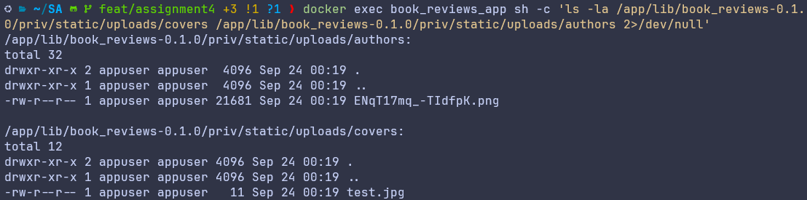
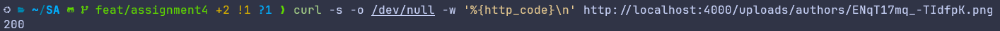
### 2.3 Browser upload checklist (book cover + author photo)

The assignment requires *book cover **and** author image* uploads. Do this in
the browser at `http://localhost:4000`:

1. Create an author: **Authors → New Author**, fill Name, pick a photo, Create.
   → The thumbnail appears on `/authors` and `/authors/<id>`.
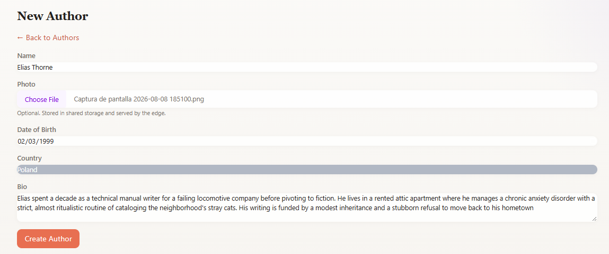
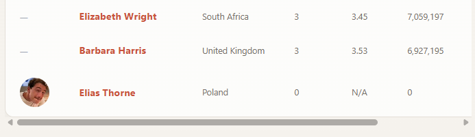

2. Create a book: **Books → New Book**, fill Title, pick the author and a cover
   image, Create. → The cover appears on `/books` and `/books/<id>`.
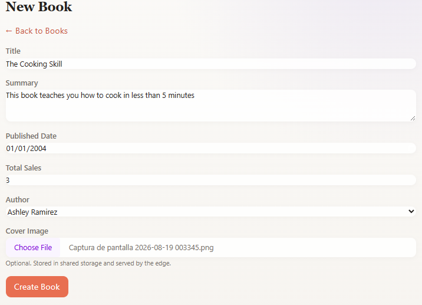


3. Inspect: the file landed on the app's local disk —
   `docker exec book_reviews_app ls /app/lib/book_reviews-0.1.0/priv/static/uploads/{covers,authors}` —
   and the `` tags on the pages fetch with 200.
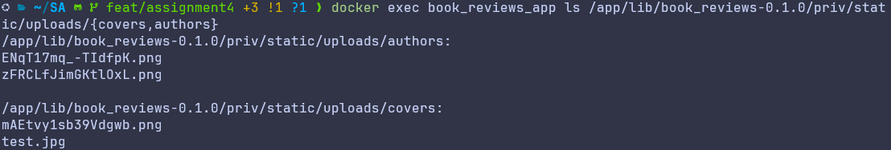
Tear down: `docker compose --profile base down`

---

## 3. Deployment 2 — Reverse Proxy (TLS + static at the edge)

Requirements: *serve under `app.localhost`; TLS terminated at the proxy;
proxy serves and caches the static assets; app no longer does.*

**What this proves:** Nginx terminates HTTPS and serves assets + uploads from
the shared `/data` volume, while the app talks only plain HTTP behind it.

### 3.1 Start

```bash
docker compose --profile proxy up -d --build
```

### 3.2 Checks — what to look for

| Run | Expected | Meaning |
|-----|----------|---------|
| `curl -sk --resolve app.localhost:443:127.0.0.1 -o /dev/null -w '%{http_code}\n' https://app.localhost/` | `200` | TLS handshake + edge forwards to app |
| `curl -s http://localhost/healthz` | `ok` | edge accepts plain HTTP (env `FORCE_SSL=false`) |
| `curl -sI http://localhost/ \| grep -i location` | `301 https://app.localhost` | HTTP→HTTPS redirect at the edge |
| `curl -skI https://app.localhost/assets/css/app.css \| grep -i cache-control` | `cache-control: public, max-age=31536000, immutable` | **edge caches** the static asset |
| `curl -sk https://app.localhost/api/features` | `{"serve_static":false,"uploads_path":"/data/uploads","static_publish_dir":"/data/static",...}` | flag flipped off: app no longer serves static |
| `curl -skI https://app.localhost/assets/css/app.css \| grep -i 'server:\|via:'` | served as edge (e.g. `server: nginx`), not Bearer/Plug | asset comes from the proxy, not the app |

Uploads written to the shared volume are served by the edge:

```bash
docker exec book_reviews_app_edge sh -c \
  'mkdir -p /data/uploads/covers && echo edge > /data/uploads/covers/e.jpg'
curl -sk -w ' -> %{http_code}\n' https://app.localhost/uploads/covers/e.jpg   # 200
```

### 3.3 Browser walkthrough — what you should see

Open `https://app.localhost` in a browser:

1. **Certificate warning** for the self-signed cert → click "Advanced / Proceed".
2. The site loads over the padlock-with-warning icon (HTTPS is active).
3. DevTools → **Network** → reload → the CSS/JS requests show a long
   `max-age=31536000` cache header and are served by nginx (200 from
   `memory`/`disk cache` on the second load).
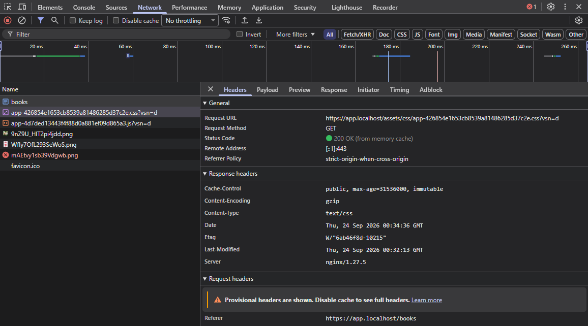
4. Upload a new author photo and book cover via the UI (same flow as 2.3);
   this time the URL in DevTools shows the file under `/uploads/...` and the
   storage path on disk is `/data/uploads/...` (shared volume):
   `docker exec book_reviews_app_edge ls /data/uploads/{covers,authors}`
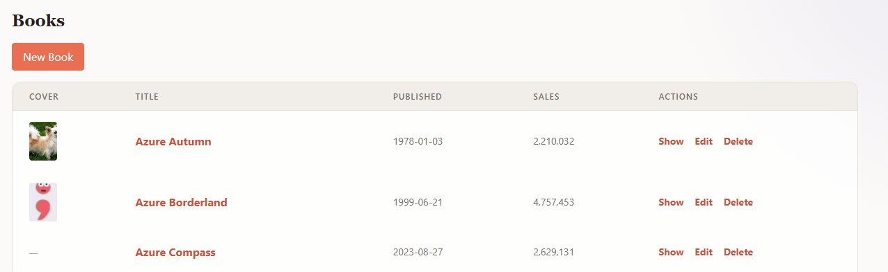
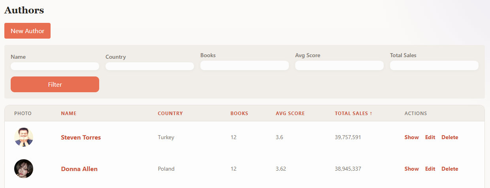
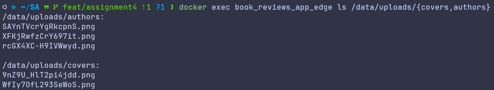

Tear down: `docker compose --profile proxy down`

---

## 4. Deployment 3 — Proxy + Cache + Search (full single instance)

Requirements (carried from Assignment 3): cache and search engine behind the
same edge; deliverable 1 deployment 3.

**What this proves:** Redis + OpenSearch run healthy and the app uses them. The
`app-full` service **waits for both to be healthy** before booting, so the
`books` search index always bootstraps against a warm engine.

### 4.1 Start

```bash
docker compose --profile full up -d --build
```

### 4.2 Checks — what to look for

| Run | Expected | Meaning |
|-----|----------|---------|
| `curl -sk https://app.localhost/api/features` | `{"cache_enabled":true,"cache_backend":"Redis","search_enabled":true,"search_backend":"OpenSearch",...}` | both A3 services wired |
| `curl -s http://localhost:9200/_cat/indices?v` | `books` index, `docs.count = 300` | seed bootstrap ran against warm engine |
| `curl -sk -o /dev/null -w '%{http_code}\n' 'https://app.localhost/books/top-selling'` | `200` | aggregation works |
| `curl -sk -o /dev/null -w '%{http_code}\n' 'https://app.localhost/books/search?q=novel'` | `200` | search window works |
| first `top-selling` hit is slow, the next are fast | hot→cache | Redis caching the aggregation (A3 behavior) |
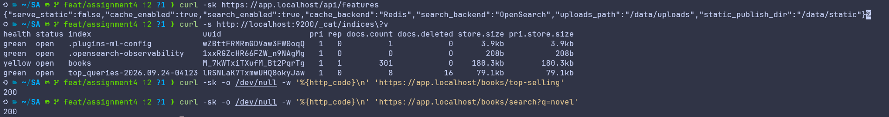
Tear down: `docker compose --profile full down`

---

## 5. Deployment 4 — Scaled (3 app instances + LB + cache + search)

Requirements: *proxy as load balancer across ≥ 3 instances; stateless
application; stopping one instance must not break the app.*

**What this proves:** three identical, stateless instances behind an Nginx
`least_conn` load balancer share MongoDB / Redis / OpenSearch and the `/data`
volume. Any instance can serve any request, and one can disappear without
impact.

### 5.1 Start and what to look for

```bash
docker compose --profile scale up -d --build
docker compose --profile scale ps
# 3 app instances (app1, app2, app3) + nginx + mongodb + cache + search, all "Up"
```

| Run | Expected | Meaning |
|-----|----------|---------|
| `curl -sk https://app.localhost/api/features` | same features JSON on every request | instances are homogeneous |
| `docker exec book_reviews_app1_scale sh -c 'ls /data/uploads'` | covers/authors present | all instances mount the same shared volume |
| DevTools / nginx logs | requests land on app1 **and** app2 **and** app3 | LB spreads the load |
| `docker logs book_reviews_nginx_scale --tail 20` | mixed upstream log lines | `least_conn` distribution |

### 5.2 Failover — the core statelessness proof

```bash
docker stop book_reviews_app1_scale          # kill instance 1
curl -sk -o /dev/null -w '%{http_code}\n' https://app.localhost/                  # 200
curl -sk -o /dev/null -w '%{http_code}\n' https://app.localhost/books/top-selling # 200
curl -sk -o /dev/null -w '%{http_code}\n' 'https://app.localhost/books/search?q=novel'  # 200
docker start book_reviews_app1_scale         # revive it
```

**What to look for:** all requests still return 200 while an instance is down —
the remaining replicas take over. Repeat browsing the app during the outage
(mid-session): the page stays up, confirming no in-memory session state is lost
bug (sessions live in shared Redis).

### 5.3 Shared uploads (writes/reads across instances)

```bash
docker exec book_reviews_app1_scale sh -c \
  'mkdir -p /data/uploads/covers && echo shared > /data/uploads/covers/s.txt'
curl -sk -w ' -> %{http_code}\n' https://app.localhost/uploads/covers/s.txt  # 200
```

**What to look for:** a file written via instance 1 is served by the edge even
after `docker stop book_reviews_app1_scale` — because storage is shared, not
per-instance. Upload via the UI on one request; verify the file exists in
`/data/uploads` (all instances see it).

**Leave this stack running for Section 7 (load test).**

Tear down: `docker compose --profile scale down`

---

## 6. Kubernetes deployment (k3d)

Requirement: *carry the full configuration to Kubernetes, app scaled to 3
replicas, the Service balances across them, your reverse proxy stays at the
edge.* (Only the **full** deployment is required on k8s.)

### 6.1 Create the cluster with a local registry

On k3s 1.35 / containerd v2, `k3d image import` can leave images invisible to
the CRI. The robust path is a k3d-managed registry:

```bash
k3d cluster delete sa-a4
k3d registry create a4-registry --port 5111
k3d cluster create sa-a4 --agents 1 --servers 1 \
  --registry-use k3d-a4-registry:5111 \
  -p "30080:30080@server:0" -p "30443:30443@server:0" --wait
```
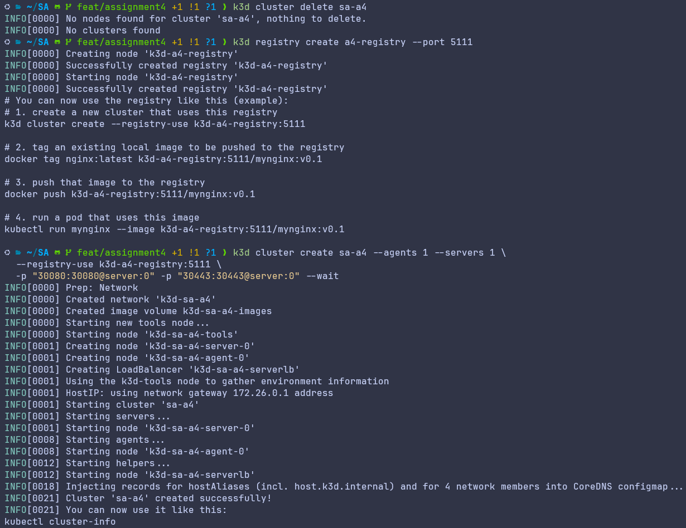
### 6.2 Push the images to the registry

```bash
for img in book_reviews/app:4.0.0 book_reviews/nginx:4.0.0 mongo:7 \
           redis:7-alpine opensearchproject/opensearch:2 busybox:1.36; do
  docker tag "$img" "localhost:5111/$img"
  docker push "localhost:5111/$img"
done
```
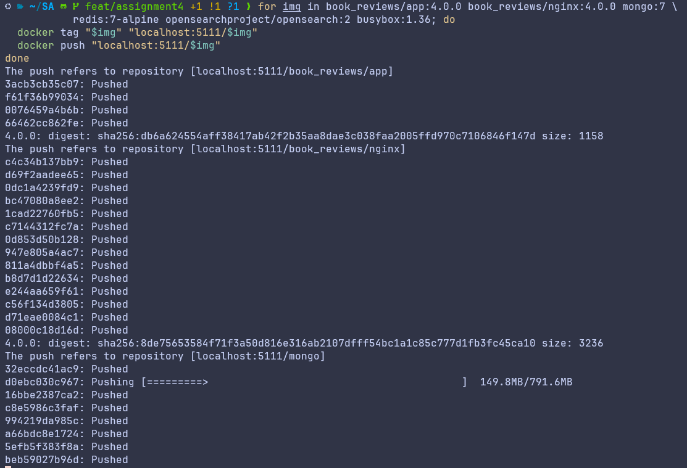

(The k3d-managed registry is already wired into every node as a mirror for the
`k3d-a4-registry:5000` hostname.)

### 6.3 Apply everything and pull the registry refs

```bash
kubectl apply -f k8s/00-namespace.yaml
kubectl apply -f k8s/11-secret.yaml -f k8s/10-configmap.yaml -f k8s/12-mongo-seed-configmap.yaml
./k8s/generate-edge-tls.sh                     # idempotent Secret creation
kubectl apply -f k8s/20-mongodb.yaml -f k8s/21-app.yaml \
  -f k8s/22-cache.yaml -f k8s/23-search.yaml \
  -f k8s/24-uploads-pvc.yaml -f k8s/30-edge.yaml -f k8s/31-edge-configmap.yaml

kubectl -n book-reviews set image deployment/book-reviews-app \
  app=k3d-a4-registry:5000/book_reviews/app:4.0.0
kubectl -n book-reviews set image deployment/book-reviews-edge \
  nginx=k3d-a4-registry:5000/book_reviews/nginx:4.0.0

kubectl -n book-reviews rollout status deploy/book-reviews-app deploy/book-reviews-edge
```
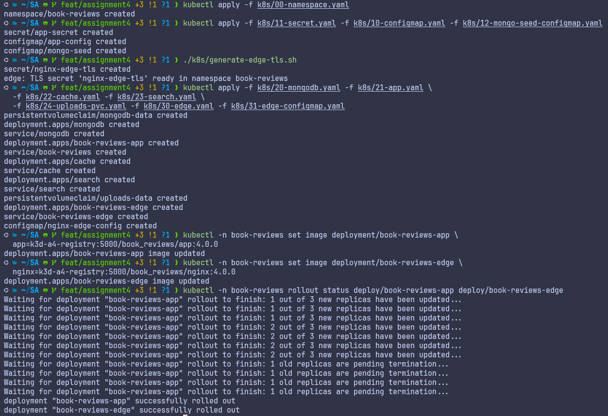
### 6.4 Checks — what to look for

| Run | Expected | Meaning |
|-----|----------|---------|
| `kubectl -n book-reviews get pods` | **3** `web` replicas + edge + db + cache + search all `Running` | horizontal scale on k8s |
| `kubectl -n book-reviews get deploy book-reviews-app -o jsonpath='{.spec.replicas}'` | `3` | replica count |
| `curl -s http://localhost:30080/healthz` | `ok` | edge NodePort up |
| `curl -sk --resolve app.localhost:30443:127.0.0.1 -o /dev/null -w '%{http_code}\n' https://app.localhost:30443/` | `200` | TLS through the edge on 30443 |
| `curl -sk --resolve app.localhost:30443:127.0.0.1 https://app.localhost:30443/api/features` | `serve_static:false`, shared paths | stateless config same as compose |
| `curl -skI --resolve app.localhost:30443:127.0.0.1 https://app.localhost:30443/assets/css/app.css` | `200` + `immutable` cache header | static at the edge, cached |
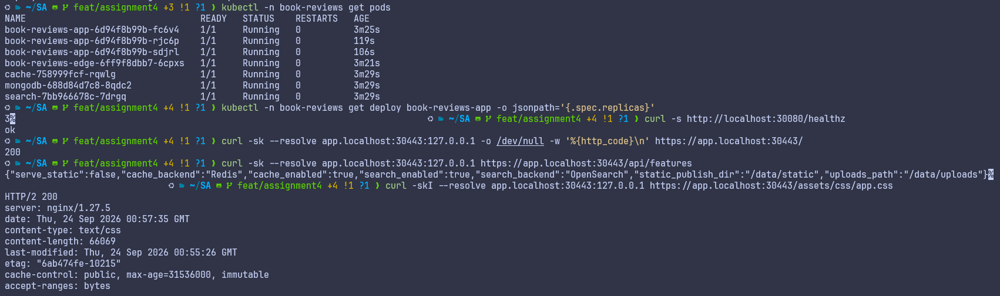
Service balancing + shared storage + failover:

```bash
POD=$(kubectl -n book-reviews get pod -l component=web -o jsonpath='{.items[0].metadata.name}')
kubectl -n book-reviews exec "$POD" -- sh -c \
  'mkdir -p /data/uploads/covers && echo k8s > /data/uploads/covers/k.jpg'
curl -sk --resolve app.localhost:30443:127.0.0.1 -w ' -> %{http_code}\n' \
  https://app.localhost:30443/uploads/covers/k.jpg          # 200 via the edge

kubectl -n book-reviews delete pod "$POD"                    # kill one replica
sleep 20                                                     # replacement pod boot
curl -sk --resolve app.localhost:30443:127.0.0.1 -w ' -> %{http_code}\n' \
  https://app.localhost:30443/uploads/covers/k.jpg          # still 200 (PVC)
```

**What to look for:** the kill of one replica leaves the app reachable (the
Controller recreates it and the Service keeps balancing to the survivors), and
the file written before the kill is still served afterwards — shared PVC, not
pod-local disk.

---

## 7. Load test — single instance vs load-balanced (x3)

Requirements (deliverable 3): *load-test the **single-instance** and the
**load-balanced (x3)** deployments; workload 1/10/100/1000/5000 requests within
5 minutes; capture per-container CPU % / memory / threads plus response times
and status codes; test 4 endpoints, one per tier, and **report each
separately**.*

### 7.1 The four endpoints and which tier each stresses

| Endpoint (loader key) | URL | Tier stressed | What a bottleneck shows up as |
|-----------------------|-----|---------------|-------------------------------|
| `static` (default `/assets/css/app.css`; set `STATIC_ASSET_PATH` to an uploaded cover/author image for edge testing) | `/assets/css/app.css` | edge / static serving | flat, very high rps, tiny latency — the edge should never be the bottleneck |
| `top_selling` (expensive aggregation) | `/books/top-selling` | app CPU + DB + cache | rps limited by CPU; **should improve with x3** (more instances = more aggregation workers) |
| `search` (search window) | `/books/search?q=novel` | search engine | slowest p50/p95; **barely improves with x3** — the shared OpenSearch engine is the single-tier bottleneck |
| `book_detail` (cheap dynamic read) | `/books/<first id>` (auto-resolved) | app + DB baseline | clean baseline; should also improve with x3 |

Without the per-endpoint split a single combined number hides **which tier
scaled and which did not** — so the loader reports each endpoint in its own
directory.

### 7.2 Run the two required targets

**A. Single-instance** — use the `full` profile (deployment 3): it is the single
instance *with* cache + search, so the tiers are comparable to the x3 run.

```bash
docker compose --profile full up -d --build
HOST_ROUTE=app.localhost:443:127.0.0.1 bash loadtest/run.sh https://app.localhost compose_full
# results -> loadtest/results/compose_full/<endpoint>/<endpoint>_<n>.summary.txt
```
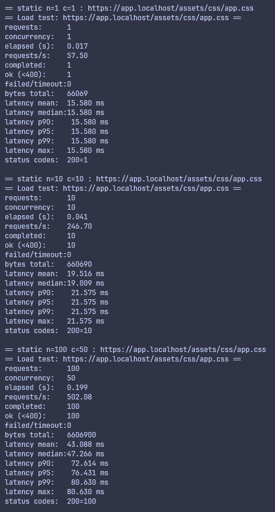
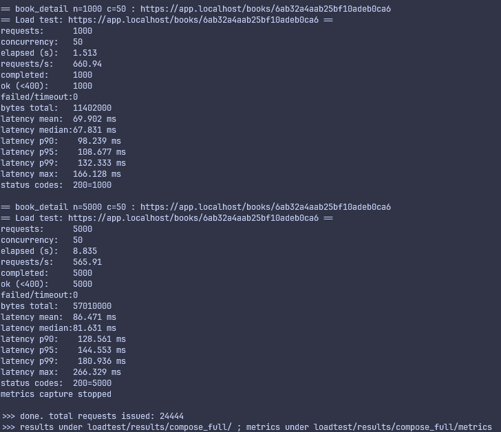
**B. Load-balanced x3**

```bash
docker compose --profile full down
docker compose --profile scale up -d --build
HOST_ROUTE=app.localhost:443:127.0.0.1 bash loadtest/run.sh https://app.localhost compose_scale
```
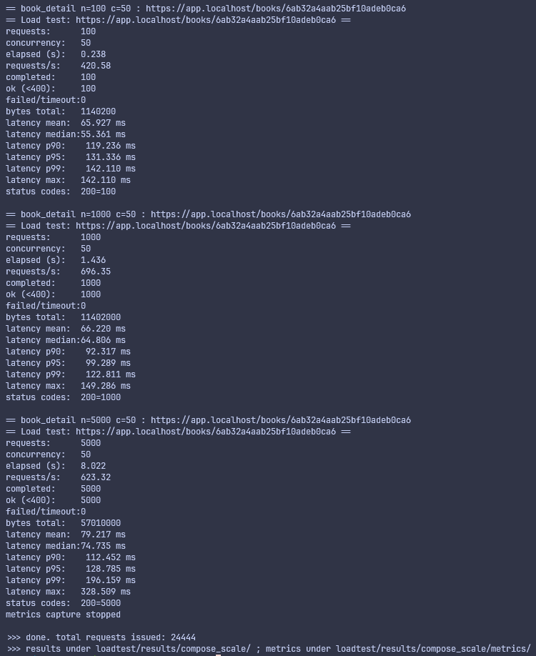
**C. (Optional) Kubernetes edge** — same matrix through the cluster NodePort:

```bash
HOST_ROUTE=app.localhost:30443:127.0.0.1 bash loadtest/run.sh https://app.localhost:30443 k8s_scale
```
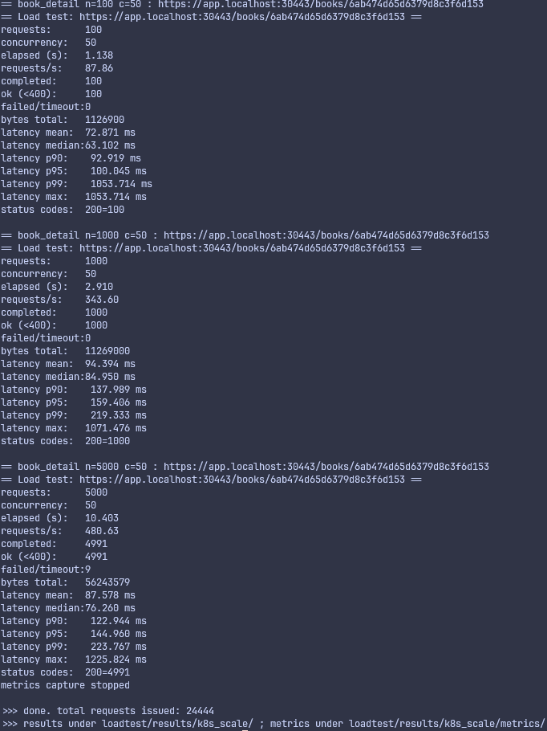
`HOST_ROUTE=app.localhost:PORT:127.0.0.1` avoids an `/etc/hosts` edit: the
loader keeps the `app.localhost` Host header, rewrites to `127.0.0.1:PORT`, and
disables cert validation (self-signed).

Each run issues 24,444 requests inside the 5-min budget:
`4 endpoints × (1 + 10 + 100 + 1000 + 5000)`. Matrices are configurable via
`MAX_SECONDS` and per-run env (see `loadtest/run.sh`).

| Tool | Role |
|------|------|
| `loadtest/load_test.py` | concurrent HTTP generator — rps, latency percentiles, status codes, CSVs |
| `loadtest/capture_metrics.sh` | per-second `docker stats` (CPU %, mem, PIDs) + thread counts via `/proc/<pid>/task`, started/stopped by `run.sh` |
| `loadtest/run.sh` | orchestrates endpoints × N and the metrics sampler |
| `loadtest/watch_metrics.sh` | standalone watcher: one `.txt` per config @1s (moved to 7.5) |
| `loadtest/plot_results.py` | matplotlib graphs of the results (requires `pip install matplotlib`) |

### 7.3 Where the results land — what to look for

```
loadtest/results/<compose_full|compose_scale|k8s_scale>/
├── static/  top_selling/  search/  book_detail/       # per-endpoint dirs
│   └── <endpoint>_<n>.summary.txt      requests/s, latency p50/p95/p99,
│                                       ok/error counts (status codes)
│       <endpoint>_<n>.latencies.csv    every request's latency & code
│       <endpoint>_<n>.console.txt          live run log
└── metrics/
    ├── docker_stats.csv                 seconds x CPU%, MEM, PIDs per container
    └── threads.csv                      seconds x thread count per container
```

**Per-container metrics:** `docker_stats.csv` has one row per sampling second
with columns per container (`cpu_percent`, `mem_usage`, `mem_limit`,
`processes`); `threads.csv` lists `ts|container|threads|count`. In the x3 run
look for three `app*` rows plus `nginx`, `cache`, `search`, `mongodb`.

**Read the summaries this way (the report's core):**

- For each endpoint, compare `requests/s` and p95 at n=5000 **single vs x3**.
- Expect `static`: rps high and latency flat — edge is not the bottleneck; no
  gain from x3 (the edge was already enough).
- Expect `top_selling`: rps **rises with x3** — the app instances were the
  bottleneck (CPU + DB aggregation) and scaling helped.
- Expect `search`: lowest rps / highest p95, and **little gain from x3** —
  OpenSearch itself is the shared bottleneck, not the app.
- Expect `book_detail`: clean baseline that also improves with x3.

Those four observations are, verbatim, the "which tier scaled and which did
not" interpretation the report asks for.

### 7.4 Plot the results

```bash
python3 loadtest/plot_results.py --dirs compose_full compose_scale k8s_scale
# -> loadtest/results/plots/
#    throughput.png       requests/s per endpoint vs request count
#    latency.png          p50/p95/p99 vs request count (deployments overlaid)
#    latencies_dist.png   per-request latency CDF at the largest size
#    metrics.png          CPU % / memory / threads per container over time
```

### 7.5 Standalone metrics watcher (one `.txt` per configuration)

Outside a full load run you can log `docker stats` (CPU %, memory) **and**
per-container thread counts every second while you manually drive the browser:

```bash
docker compose --profile scale up -d
loadtest/watch_metrics.sh scale 60     # sample for 60 s -> results/scale/metrics/

loadtest/watch_metrics.sh all 30       # 30 s per profile, one .txt each
# -> results/base/metrics/docker_stats.txt, results/proxy/metrics/docker_stats.txt, ...
```

`watch_metrics.sh <config> 0` (or no duration) runs until Ctrl-C.

---

## 8. Unit tests & formatting

```bash
mise x -- mix format --check-formatted
mise x -- mix compile --warnings-as-errors
mise x -- mix test
# 13 tests, 0 failures (incl. BookReviews.UploadsTest)
```

---

## 9. Report checklist (deliverable 4)

The report lives in `REPORT4.md` (≤ 15 pages). Each required section maps to
material collected by this guide:

| Report requirement | Where the material is |
|--------------------|-----------------------|
| Architecture of each deployment + interaction | 2–6 above, `docker-compose.yml` profiles, `k8s/` manifests |
| Advantages/disadvantages of reverse proxy, TLS at edge, static at edge (CDN) | Nginx behavior observed in 3 (TLS, redirect, immutable cache, one entry point); trade-offs discussion in report |
| Strengths/weaknesses of Nginx | `nginx/` config (`least_conn` upstream, `assets` caching, TLS block); edge logs |
| Cost of making the app stateless | `lib/` changes: `SERVE_STATIC_ASSETS`/`UPLOADS_PATH`/`STATIC_DIR` plumbing, session in Redis, uploads to shared volume/PVC |
| Load-test results single vs x3, per endpoint, bottleneck interpretation | 7 results + 7.3 reading guide + `loadtest/results/plots/*.png` |
| Conclusion | synthesize from the bottleneck table |

---

## 10. Tear down

```bash
docker compose --profile scale down          # or the profile currently running
docker compose --profile full down
kubectl delete namespace book-reviews
k3d registry delete a4-registry
k3d cluster delete sa-a4
```